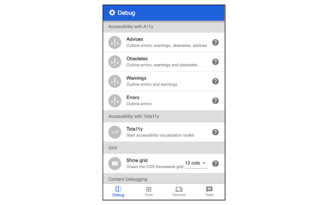
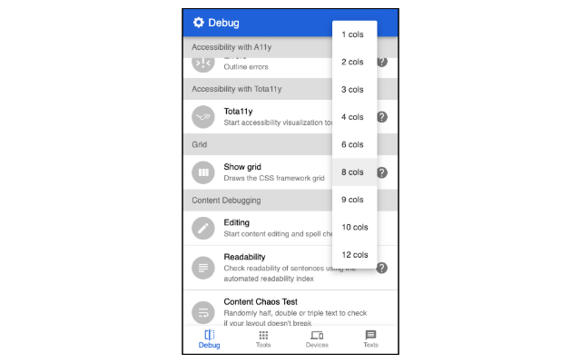
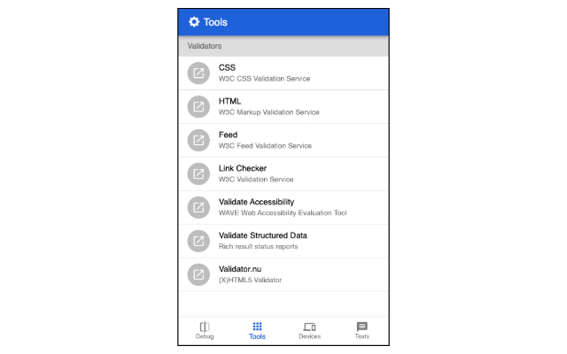
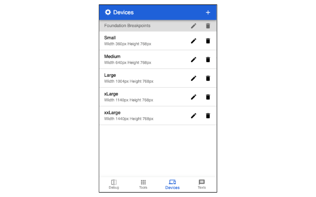
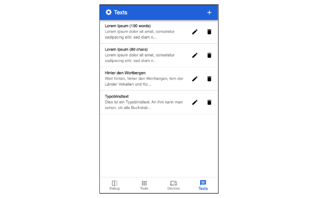

# Dirty-Little-Helper

Dirty Little Helper - Developer Tool Set

## What is it good for?

With this toolset you can open a web page in an active tab in several popup windows with a specific size.

You are able to show and hide HTML settings and markup.

You can insert different specified texts to editable forms.

## Features

### Debugging

- Accessibility with A11y and Tota11y
- Grid support for Foundation and Bootstrap CSS Framework
- Content Live editing, Readability tests and Content chaos tests
- Outlines for: Layout, Focus, Headings, Images, Anchors, Buttons, Z-Index
- Disable Styling, Images
- Show unneeded Scrollbars

### Validation

Validation is based on W3C Validation tools and others.

- Validation for: CSS, HTML, Feed, Link Checker, Wave Accessibility, Structured Data

### Devices

You can add devices and groups for size simulation. Clicking on a device or group opens a browser window in the specified size and the set UserAgent.

### Texts

You have the possibility to add texts for insertion. These can be inserted into any input fields.

## Screenshots

|  |  |  |  |  |
|:---:|:---:|:---:|:---:|:---:|
| Debugging | Debugging | Validators | Devices | Texts |
